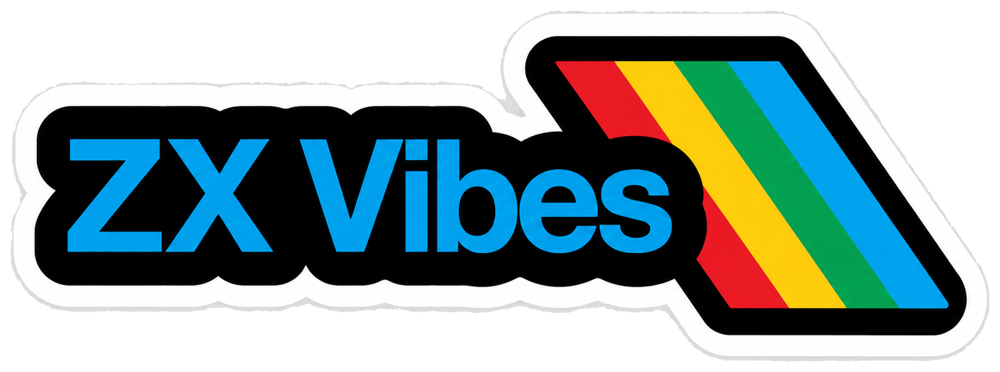

<p align="center">
  
</p>

# ZX Vibes

ZX Spectrum vibe-coding toolkit for coding agents and humans.

`zx-vibes` packages the feedback loop needed to create, build, run, inspect,
debug, and publish small ZX Spectrum 48K projects from one modern toolchain. It
combines a TypeScript Z80 assembler/disassembler, a headless and browser-capable
emulator, the `zxs` CLI, an MCP server for agent integrations, starter projects,
reference docs, and a public gallery.

- Public gallery: <https://alvaromah.github.io/zx-vibes/>
- npm packages: `zx-vibes`, `create-zx-vibes`, `@zx-vibes/toolkit`,
  `@zx-vibes/asm`, and `@zx-vibes/emulator`
- Runtime: Node.js 20 or newer
- Package manager: pnpm recommended

## What You Get

- `pnpm create zx-vibes` to scaffold a working Spectrum project.
- `zxs build`, `zxs run`, `zxs verify`, and `zxs preview` for the local loop.
- `zxs boot` and `zxs play` for browser playback of a clean 48K machine,
  snapshots, and tape files.
- Snapshot, memory, graphics, disassembly, scan, and xref commands for
  inspection and reverse-engineering workflows.
- `zxs-mcp` for Codex, Claude, and other MCP-capable coding agents.
- A default embedded assembler from `@zx-vibes/asm`, exposed directly as
  `zxasm`.
- Optional `sjasmplus` support for advanced assembler workflows.
- A ZX Spectrum 48K emulator package for headless tests and browser players.
- Reference notes and project-local agent skills for assembler syntax, memory,
  screen layout, keyboard input, ROM routines, colour attributes, timing, sound,
  testing assertions, reverse engineering, and common Spectrum bugs.

## Quick Start From npm

Create a project from the published npm package:

```bash
pnpm create zx-vibes my-game --template game
cd my-game
npm run doctor
npm run build
npm run verify
npm run preview
```

Use the `platformer` starter when you want a slightly more game-shaped baseline:

```bash
pnpm create zx-vibes my-platformer --template platformer
cd my-platformer
npm run verify
```

For a complete install-to-verified-project manual, including Codex, Claude
Code, optional MCP setup, and the manual CLI loop, see
[`docs/manual/`](docs/manual/index.md). The published manual lives under the
Pages site at <https://alvaromah.github.io/zx-vibes/manual/>.

The generated project includes:

- `src/main.asm` as the assembler entry point.
- `lib/` helpers for screen and keyboard routines.
- `tests/smoke.test.json` for declarative verification.
- `zx.config.json` for build configuration.
- `AGENTS.md` and `CLAUDE.md` with the same agent playbook, plus local
  `docs/agents/skills/` and `docs/reference/` material for agent and human
  guidance.
- `.mcp.json` for Claude-compatible MCP clients and
  `docs/agents/codex-mcp.toml` for Codex.
- npm scripts for `doctor`, `build`, `run`, `screen`, `test`, `verify`,
  `preview`, and advanced `zxs` passthrough commands.
- a `zx-vibes` dev dependency floor of `^0.1.3`, which resolves to the current
  compatible patch release on normal installs.

`pnpm create zx-vibes` and `zxs new` both install dependencies by default. Use
`--no-install` for offline work or when testing an unpublished local checkout.

## Working With an Agent

After creating a project, open it with your coding agent and give it a concrete
Spectrum task:

```text
Create a simple arcade game for the ZX Spectrum.
Build it, run it, inspect the screen, and iterate until verify passes.
```

The intended loop is:

1. Edit Z80 assembly.
2. Run `npm run build`.
3. Run `npm run run`.
4. Inspect the screen with `npm run screen`.
5. If sound is part of the task, assert `audio.beeperEdges > 0` in run JSON or
   add a declarative `{ "type": "beeperEdges", "min": 1 }` test.
6. Run `npm run verify`.

Agents can use the same commands directly, or connect through the MCP server for
structured build, run, screen, inspect, debug, keyboard, and state tools. The
CLI is also useful during investigation work because most inspection commands
can read a session, `.sna`, `.z80`, or raw `--bin` source without mutating the
project state.

If you want the classic "program installed in my shell" workflow, install the
umbrella package globally once:

```bash
npm install -g zx-vibes
zxs doctor
zxs verify
```

For advanced one-off commands without a global install, generated projects also
provide `npm run zxs -- <command>`, for example `npm run zxs -- regs`.

## CLI Basics

Install globally when you want `zxs` and `zxasm` to behave like normal shell
programs:

```bash
npm install -g zx-vibes
zxs --help
zxasm --help
```

Common commands:

```bash
zxs new demo --template game
zxs doctor
zxs build
zxs run --bin build/main.bin --org 0x8000 --frames 300 --screenshot screen.png
zxs screen --text --png screen.png
zxs test tests
zxs test tests --list-assertions
zxs verify
zxs preview --port 5173 --watch
zxs boot
zxs play game.z80
zxs bench --frames 2000
```

`zxs preview` serves a browser player with a visible build hash. Add
`--watch` to rebuild the snapshot and reload the page when source/config files
change. If the requested port is busy, preview tries later ports and prints the
URL it actually selected; add `--strict-port` when a busy `--port` should be an
error. Use `--detach`, `--list`, and `--stop` when you want the preview server
to keep running outside the current command. Detached server records include a
local ownership token, so `--stop` only stops the tracked zx-vibes preview
server.

`zxs boot` opens a clean ZX Spectrum 48K boot screen in the same browser player.
`zxs play <file>` opens `.z80`, `.sna`, `.tap`, and `.tzx` files without
creating a project first. Tape playback preserves `.tap` and `.tzx` filenames
so the emulator can select the correct parser. The emulator supports `.z80` v1
snapshots plus 48K-compatible `.z80` v2/v3 snapshots; 128K paging is not
supported.

Debug and inspection commands are also available:

```bash
zxs regs
zxs mem read 0x8000 --len 64
zxs mem dump --range 0x4000-0x5aff --out screen.ram
zxs break add 0x8000
zxs watch add --write 0x5800-0x5aff
zxs step 10
zxs disasm PC --count 12 --json
zxs trace --frames 5
zxs state save session.zxstate
zxs state export --z80 session.z80
zxs snapshot info game.z80
zxs snapshot ram game.z80 --out game.ram
zxs snapshot mem game.z80 0x4000 --len 32
zxs gfx screen --z80 game.z80 --out screen.png
zxs gfx attrs --z80 game.z80 --out attrs.png
zxs gfx find --z80 game.z80
zxs scan --z80 game.z80 --opcode "ED B0"
zxs xref 0x5c00 --z80 game.z80
```

## MCP Server

`zx-vibes` exposes `zxs-mcp`, an MCP server for coding agents. Generate local
configuration snippets with:

```bash
zxs setup --agent codex
zxs setup --agent claude
```

For Codex, the config shape is:

```toml
[mcp_servers.zx_vibes]
command = "pnpm"
args = ["exec", "zxs-mcp"]
startup_timeout_sec = 30
tool_timeout_sec = 300
```

For Claude-compatible clients:

```json
{
  "mcpServers": {
    "zx_vibes": {
      "command": "pnpm",
      "args": ["exec", "zxs-mcp"]
    }
  }
}
```

Generated projects already include `.mcp.json` and
`docs/agents/codex-mcp.toml` with this local `pnpm exec zxs-mcp` shape.

## Assembler Backends

The default backend is `@zx-vibes/asm`, a TypeScript Z80 assembler and
disassembler that works without native dependencies. Use `zxasm` directly when
you want the standalone assembler CLI:

```bash
zxasm assemble src/main.asm -I lib --out-dir build
zxasm disasm build/main.bin --org 0x8000 --count 32
zxasm doctor
```

The embedded backend name in `zxs build --assembler` remains `spectral` for
compatibility with older configuration. `spectral-asm` also remains a bin alias
for `zxasm`.

For projects that need a `sjasmplus` feature, install `sjasmplus` separately
and select it with either:

```bash
ZXS_ASSEMBLER=sjasmplus zxs build
zxs build --assembler sjasmplus
```

The starter projects are designed to work with the embedded assembler by
default.

## Using This Repository

Clone the monorepo when you want to work on the toolkit itself:

```bash
git clone https://github.com/Alvaromah/zx-vibes.git
cd zx-vibes
pnpm install
pnpm run verify
```

Useful root commands:

```bash
pnpm run check:drift
pnpm run build
pnpm run typecheck
pnpm run lint
pnpm run test
pnpm run pack
pnpm run verify
```

`pnpm run verify` runs generated-asset drift checks first, then build,
typecheck, lint, and tests. Drift checks compare root starters with toolkit
templates, root docs with copied package docs, create-package assets with root
source assets, and gallery browser bundles with the current emulator bundle.

### Local Clone Workflows

`pnpm exec zxs ...` is a project-local command. It expects to run inside a
directory with a `package.json`, so from an empty parent directory pnpm exits
before `zxs` starts. When testing a clone before publishing changes, build the
monorepo and invoke the built CLI directly:

```bash
cd /path/to/zx-vibes
pnpm install
pnpm run build

mkdir -p /tmp/zx-vibes-local
cd /tmp/zx-vibes-local
node /path/to/zx-vibes/packages/toolkit/dist/cli/index.js new my-game --template platformer --no-install
cd my-game
node /path/to/zx-vibes/packages/toolkit/dist/cli/index.js verify
```

Published `zxs new` installs `zx-vibes` by default. Use `--no-install` when
testing an unpublished local checkout as above. Once dependencies are installed,
use the normal project-local commands:

```bash
npm run verify
npm run preview
```

`pnpm run pack` writes package tarballs to `.packs/`. Installing only
`.packs/zx-vibes-*.tgz` is not an all-local monorepo install: packed
`workspace:*` dependencies are rewritten to exact published versions, so
`@zx-vibes/toolkit`, `@zx-vibes/asm`, and `@zx-vibes/emulator` resolve like
regular registry dependencies. Use the built CLI workflow above for local
clone testing, or publish all package tarballs to a local registry when you
need to test unpublished package metadata together.

Target a single package when iterating:

```bash
pnpm --filter @zx-vibes/toolkit test
pnpm --filter @zx-vibes/asm test
pnpm --filter @zx-vibes/emulator test
pnpm --filter create-zx-vibes run check:assets
```

## Monorepo Layout

```text
docs/                     Manual, shared reference docs, and MCP config snippets
gallery/                  Built GitHub Pages gallery output
packages/asm/             @zx-vibes/asm assembler/disassembler
packages/create-zx-vibes/ create-zx-vibes project generator
packages/emulator/        @zx-vibes/emulator Spectrum emulator
packages/toolkit/         @zx-vibes/toolkit CLI, MCP server, recipes, gallery
packages/zx-vibes/        zx-vibes umbrella package and bin shims
starters/                 Source starter projects copied by the generator
```

## Published Packages

Current manifests and npm registry versions match as of 2026-06-16:

| Package | Version | Public surface |
| --- | ---: | --- |
| `zx-vibes` | `0.1.4` | Umbrella package with `zx-vibes`, `zxs`, `zxs-mcp`, and `zxasm` bins. |
| `create-zx-vibes` | `0.2.0` | `create-zx-vibes` bin used by `pnpm create zx-vibes`. |
| `@zx-vibes/toolkit` | `0.2.1` | `zxs`, `zxs-mcp`, and `zx-vibes` bins; package exports for CLI and MCP internals. |
| `@zx-vibes/asm` | `0.1.2` | `zxasm` bin plus `spectral-asm` compatibility alias; assembler/disassembler API. |
| `@zx-vibes/emulator` | `0.1.3` | Browser bundle, ROM assets, examples, and JavaScript emulator exports. |

`zxs --version` reports the toolkit version because the CLI is implemented by
`@zx-vibes/toolkit`. `zxasm --version` reports the assembler package version.

## Gallery and Docs

The public gallery is deployed with GitHub Pages at
<https://alvaromah.github.io/zx-vibes/>. It showcases generated Spectrum games
with playable browser snapshots, screenshots, metadata, and transcripts.

The published manual is available at
<https://alvaromah.github.io/zx-vibes/manual/>. Markdown source lives in
`docs/manual/`, and the Pages workflow builds it with VitePress into
`gallery/manual/` before uploading the `gallery/` artifact.

Root `gallery/` is the Pages deployment source. `packages/toolkit/gallery/`
contains package-side gallery assets, and both gallery browser bundles are
checked against `packages/emulator/dist/zxgeneration.esm.js` by
`pnpm run check:gallery-bundles`.

Reference docs live in `docs/reference/`; project-local agent skills live in
`docs/agents/skills/`. Manual, reference, and agent docs are copied into the
create-package docs, while reference and agent docs are also copied into
generated projects and toolkit package docs. `pnpm run check:drift` verifies
those copied docs stay in sync.

## Release, CI, and Security

CI runs on Ubuntu, macOS, and Windows across Node 20 and 22. The required path
is `check:drift`, build, a clean `git diff`, typecheck, lint, and tests. The
`main` branch is protected with those six CI matrix jobs as strict required
checks, and force pushes/deletion are disabled.

Releases use Changesets. The release workflow validates on Node 20 and 22, then
only publishes when manually dispatched with `publish=true`; the publish job
installs, builds, runs `pnpm run pack`, verifies npm auth, and then runs
`pnpm changeset publish`.

Security posture as of 2026-06-16: root pnpm overrides pin patched transitive
dependency floors for `form-data@4.0.6`, `js-yaml@4.2.0`, and
`read-yaml-file@2.1.0`; GitHub Dependabot reports no open alerts; and
`pnpm audit --audit-level moderate` reports no known vulnerabilities.

## Contributing

Contributions are welcome while the project is still early. Before opening a
pull request, run:

```bash
pnpm install
pnpm run verify
pnpm run pack
```

Keep starter projects compatible with the embedded assembler unless a change is
explicitly about optional `sjasmplus` support. If you change starter assets,
make sure the generator package assets stay in sync.

## License

The zx-vibes source code is released under the MIT License. See
[`LICENSE`](LICENSE).

The repository includes a ZX Spectrum 48K ROM for emulator use. That ROM is
copyrighted material distributed under the permission described in
[`packages/emulator/rom/README.md`](packages/emulator/rom/README.md). The ROM
notice is separate from the MIT license that covers the zx-vibes source code.
