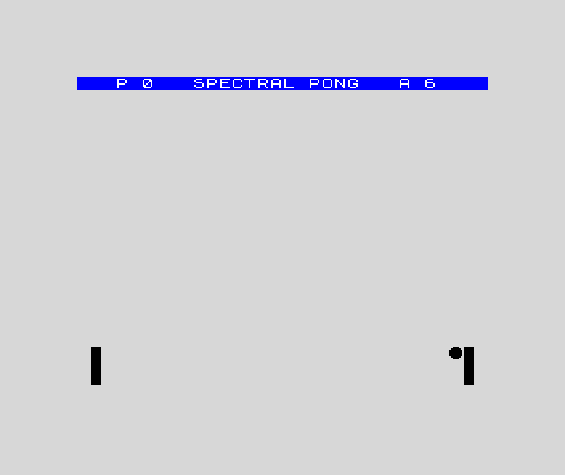

# Pong — written by an AI agent, unassisted

The Phase 4 milestone artifact: a playable ZX Spectrum 48K Pong built
**entirely by an AI agent** using the Spectral toolkit, with no human help.



## Provenance (full transparency)

- **Agent**: Claude (general-purpose subagent), driven only by the scaffold's
  CLAUDE.md playbook, the `docs/` references, and the `zxs` CLI.
- **Starting point**: `zxs new pong` (the stock QAOP skeleton — no game code).
- **Effort**: ~8 build/run cycles, 40 tool calls, ~11 minutes wall clock.
- **The bug story**: the agent's only real bug was a zero-terminated string
  printer colliding with the `0x00` row operand inside an `AT 0,3` control
  sequence — the ROM was left mid-command and the program crashed into the
  BASIC editor. The hang watchdog could NOT flag it (the BASIC editor is
  itself HALT-synced); the cheap screen observability did:
  `nonBlankCells: 1` and a lone "K" cursor in `zxs screen --text`. The agent
  then diagnosed it with `zxs break add print_score`, `zxs run --until-break`
  and `zxs mem read` of the channel sysvars — no guessing.

## Mechanics

Q/A moves the left paddle; the right paddle is a (currently unbeatable)
ball-tracking AI. Ball bounces off walls and paddles, scores reset it to the
center serving toward the scorer. ROM-printed score line. HALT-synced
(`haltSynced: true`), all drawing XOR-based, 23 non-blank cells steady.

## Verify it yourself

```bash
zxs test examples/pong-by-agent          # 2/2 specs
zxs build examples/pong-by-agent/main.asm
zxs run --bin build/main.bin --org 0x8000 --frames 800 \
    --keys "100:Q*40,300:A*60" --screenshot pong.png
```
